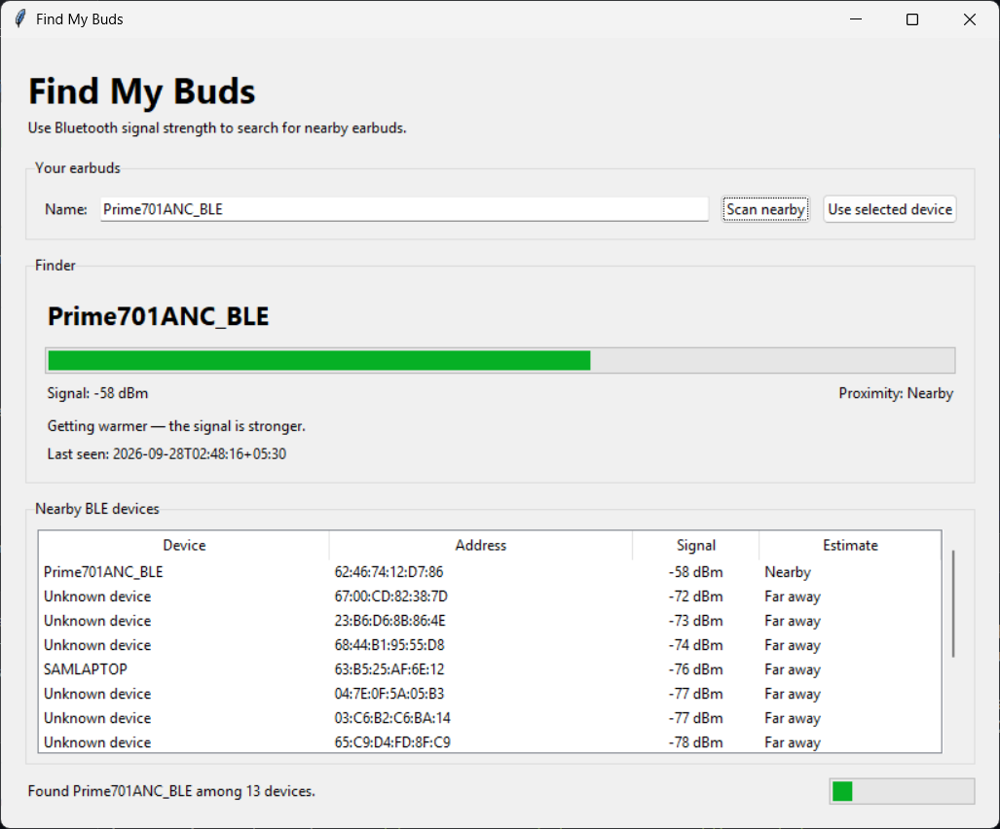

# Find My Buds

A small Windows desktop app that uses Bluetooth Low Energy (BLE) signal strength
to help find nearby earbuds. It scans nearby devices, remembers the selected
earbuds, reports broad proximity, and compares consecutive scans to tell you if
you are getting warmer or colder.

## What it can and cannot do

Find My Buds uses RSSI (received signal strength), not GPS. RSSI changes with
walls, furniture, your body, radio interference, and the earbud model, so the
distance labels are estimates.

Many earbuds stop advertising when their charging case is closed. No Bluetooth
scanner can find them in that state unless the hardware provides a dedicated
finding network such as Apple Find My, Google Find Hub, or Samsung SmartThings
Find.

## Requirements

- Windows 10 or 11
- Python 3.10 or newer
- Bluetooth enabled
- Earbuds that advertise over BLE

## Install and run

From PowerShell in this directory:

```powershell
python -m venv .venv
.venv\Scripts\Activate.ps1
python -m pip install -r requirements.txt
python find_earbuds.py
```

If PowerShell blocks activation, the virtual environment is optional; install
with `python -m pip install -r requirements.txt` and run the app directly.

## Using the app

1. Open the earbud case or put the earbuds in pairing mode.
2. Select **Scan nearby**.
3. Select the earbuds in the device table and choose **Use selected device**.
4. Move to another position and scan again.
5. Follow the signal value and warmer/colder message. A value around `-40 dBm`
   is strong, while a value around `-90 dBm` is weak.

You can also type part of the Bluetooth device name before scanning.

### Auto-rescan

Enable **Auto-rescan** in the toolbar to have the app scan automatically on a
fixed interval (15 s / 30 s / 1 min / 2 min). Walk room-to-room while the app
reports the signal level after each pass. Each completed scan resets the timer,
and manually clicking **Scan nearby** cancels any pending auto-rescan.

### Scan duration

The **Scan duration** dropdown sets how long each BLE discovery window lasts
(3 / 5 / 8 / 10 seconds). Use a shorter window when the earbuds are nearby and
a longer one when the signal is weak or the earbuds are in another room.

### RSSI history

After two or more scans that find the target device, the Finder panel shows the
last few raw RSSI readings and their average. A stable average is more reliable
than any single snapshot.

The saved target, scan settings, and last-seen time are stored in
`.find_my_buds.json` in your home folder. No scan data is sent over the internet.

## Live Bluetooth test

A manual scan successfully detected `Prime701ANC_BLE` among 13 nearby BLE
devices. The `-58 dBm` signal was classified as **Nearby**, and a second scan
reported that the signal was getting warmer.



## Run tests


```powershell
python -m unittest discover -s tests -v
```

## Troubleshooting

- **Nothing appears:** Verify Bluetooth is on, open the charging case, and try
  pairing mode.
- **The earbuds are connected but absent:** Some devices use Classic Bluetooth
  for audio and do not emit discoverable BLE advertisements continuously.
- **The signal jumps around:** Rescan from the same position and use broad trends
  rather than treating RSSI as an exact distance.
- **Access or scanning error:** Check Windows Bluetooth/privacy permissions and
  close other tools that may be controlling the Bluetooth adapter.
